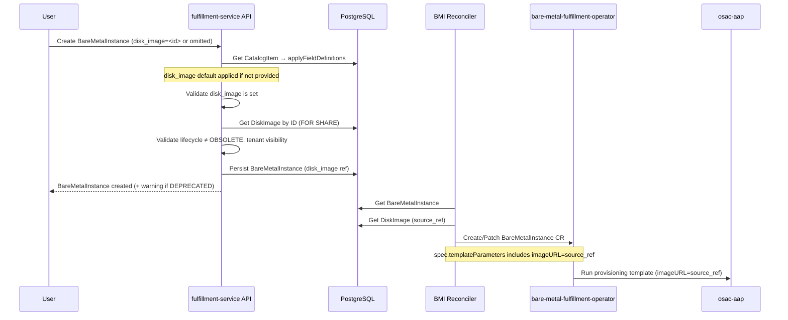

# Base OS Management for Bare Metal Instances

## Summary

This design integrates the DiskImage resource (defined in [OSAC-2540](https://redhat.atlassian.net/browse/OSAC-2540)) into the BMaaS provisioning path, replacing the inline `BareMetalInstanceSpec.image` field with a governed DiskImage reference and extending DiskImage deletion protection to bare-metal resources. See [PRD](prd.md) for detailed requirements.

## Motivation

`BareMetalInstanceSpec` currently carries an inline `image` field (`source_type` + `source_ref`) that accepts any arbitrary OCI URL. This provides no discoverability, no lifecycle governance, and no access control — tenants must know the exact image URL and cannot browse a curated catalog. Cloud Provider Admins and Tenant Admins have no structured mechanism to publish, version, or deprecate OS images independently.

OSAC-2540 solves this problem for VMaaS by introducing the DiskImage resource — a governed image catalog with lifecycle management (available → deprecated → obsolete), two-tier visibility (global + tenant-scoped), and deletion protection. This design extends that solution to BMaaS.

The integration point is narrow: the bare-metal provisioning stack already accepts images as a `imageURL` JSON template parameter, so DiskImage is resolved in the fulfillment-service reconciler before the BareMetalInstance CRD is written. The bare-metal-fulfillment-operator and osac-aap provisioning templates require no changes.

### Goals

- Reuse the DiskImage resource, API, lifecycle, and two-tier visibility model from OSAC-2540 without modification.
- Keep the bare-metal-fulfillment-operator CRD unchanged — DiskImage resolution stays in the fulfillment-service reconciler.
- Replace `BareMetalInstanceSpec.image` with `disk_image` and remove `BareMetalInstanceImage` message entirely.
- Extend DiskImage deletion protection to `bare_metal_instances` and `bare_metal_instance_catalog_items` via database triggers.
- DiskImage defaults for BareMetalInstance creation come from `BareMetalInstanceCatalogItem.field_definitions`, reusing the existing field definition mechanism without schema changes.

### Non-Goals

- Custom OS image upload by tenants.
- In-place OS upgrade or OS configuration management beyond initial boot.
- Adding a `disk_image` field to `BareMetalInstanceTemplate` — defaults are carried on the CatalogItem.
- Exposing `guest_os_family` to the BMaaS provisioning path — AAP templates consume only `imageURL`.
- Any changes to the DiskImage resource itself (its API, lifecycle, or visibility rules are fixed by OSAC-2540).

## Proposal

`BareMetalInstanceSpec.disk_image` replaces the inline `image` field as a reference to a DiskImage by ID. At creation time, the server resolves the DiskImage reference (from the user or from the CatalogItem's `field_definitions`), validates it against the DiskImage lifecycle and visibility rules, and persists the BareMetalInstance. The reconciler then fetches the DiskImage's `source_ref` and injects it as `params["imageURL"]` — the same JSON template parameter the AAP provisioning roles already consume. This keeps the operator CRD and all downstream provisioning code unchanged.

Deletion protection is extended by updating the `check_disk_image_not_in_use` database trigger (introduced by OSAC-2540) to also query `bare_metal_instances` and `bare_metal_instance_catalog_items`. A complementary BEFORE INSERT OR UPDATE trigger on `bare_metal_instances` validates inbound `disk_image` references with `FOR SHARE` locking, matching the TOCTOU protection pattern from OSAC-2540.

### Workflow Description

#### Registering and publishing a DiskImage for bare-metal use

DiskImage registration is unchanged from OSAC-2540. A Cloud Provider Admin calls `DiskImages/Create` with `source_type`, `source_ref`, `guest_os_family`, and `architecture`. The resulting DiskImage is available for both VMaaS and BMaaS provisioning — no separate registration step is required.

A Cloud Provider Admin then creates or updates a `BareMetalInstanceCatalogItem`, adding a `field_definitions` entry that sets a default `spec.disk_image` value. Tenant users creating a `BareMetalInstance` from this catalog item automatically receive the default DiskImage without needing to select one.

#### Creating a BareMetalInstance with a DiskImage



The diagram shows the two-phase flow: the API validates the DiskImage reference and persists the BareMetalInstance, then the reconciler resolves `source_ref` and passes it as `imageURL` to the provisioning template. The operator CRD carries no image field — the image URL is injected as a JSON template parameter.

**Steps:**

1. User calls `BareMetalInstances/Create` with `spec.disk_image` set (or omits it if the CatalogItem carries a default).
2. Server calls `validateAndApplyCatalogItem()`, which calls `applyFieldDefinitions()`. If the CatalogItem's `field_definitions` include a `spec.disk_image` entry and the user did not provide one, the default is applied.
3. Server validates `spec.disk_image` is set — returns `InvalidArgument` if missing after defaults are applied.
4. Server fetches the referenced DiskImage. Returns `NotFound` if absent.
5. Server validates tenant visibility (global DiskImage or same tenant). Returns `PermissionDenied` if inaccessible.
6. Server validates lifecycle is not `DISK_IMAGE_LIFECYCLE_OBSOLETE`. Returns `FailedPrecondition` with message: `"cannot create bare metal instance: disk image is obsolete"`.
7. If lifecycle is `DISK_IMAGE_LIFECYCLE_DEPRECATED`, a warning is appended to `BareMetalInstancesCreateResponse.warnings`: `"disk image '<id>' is deprecated"`.
8. Server persists the BareMetalInstance with the `disk_image` reference.
9. The reconciler fetches the DiskImage's `spec.source_ref` and injects it as `params["imageURL"]` in the JSON template parameters written to `BareMetalInstanceSpec.templateParameters` on the CRD.
10. The operator passes `templateParameters` to the AAP provisioning role, which reads `template_params.imageURL` to set the boot image.

#### Deleting a DiskImage referenced by a BareMetalInstance

1. Admin calls `DiskImages/Delete`.
2. The BEFORE UPDATE trigger on `disk_images` fires and queries `bare_metal_instances` for active references (`deletion_timestamp = 'epoch'`).
3. If any exist, the trigger raises SQLSTATE `Z0003`. The DAO translates this to `FailedPrecondition` with a message identifying the referencing resource.
4. Admin deletes or reprovisioned the referencing BareMetalInstances, then retries deletion.

### API Extensions

**Modified gRPC messages:**

`BareMetalInstanceSpec` (public and private):
- `image` (`BareMetalInstanceImage`) — removed, field name reserved.
- `disk_image` (`string`, `IMMUTABLE`) — added. References a DiskImage by ID.

`BareMetalInstanceTemplateSpecDefaults` (public and private):
- `image` (`BareMetalInstanceImage`) — removed, field name reserved. No replacement: DiskImage defaults are carried on `BareMetalInstanceCatalogItem.field_definitions`.

`BareMetalInstancesCreateResponse` (public and private):
- `warnings` (`repeated string`) — added. Carries non-fatal notices, matching the `ComputeInstancesCreateResponse` pattern.

`BareMetalInstanceCatalogItemsCreateResponse` and `BareMetalInstanceCatalogItemsUpdateResponse` (public and private):
- `warnings` (`repeated string`) — added. Carries non-fatal notices when `field_definitions` reference a DEPRECATED DiskImage.

`BareMetalInstanceImage` message — removed from both public and private type protos.

**No new gRPC services.** The `DiskImages` service is defined and implemented by OSAC-2540.

**No CRD changes.** The `BareMetalInstance` CRD in `bare-metal-fulfillment-operator` has no image field and is unchanged.

**Operational impact:** If the fulfillment-service is down, BareMetalInstance creation is unavailable. Existing BareMetalInstances already provisioned are unaffected — the bare-metal-fulfillment-operator manages their lifecycle independently.

## UX Alignment

`@temp-api` file exists at `osac-ux/libs/ui-components/src/api/v1/baremetal-instance.ts`. It defines `useCreateBareMetalInstance` with a hardcoded `spec` shape that does not yet include a `diskImage` field. Two updates are needed when this design lands:

1. **`@osac/types` (auto):** Running `pnpm gen-types` picks up the new proto `disk_image` field automatically — no manual edit required.
2. **`useCreateBareMetalInstance` (manual):** The hardcoded `mutationFn` body type must be updated to add `diskImage?: string` to `spec`, so the creation form can pass the selected DiskImage ID.

**Field mapping:**

| Proto field | TypeScript field | Direction |
|-------------|-----------------|-----------|
| `spec.disk_image` | `spec.diskImage` | proto → TS (camelCase) |

Beyond this, the UI migration mirrors the ComputeInstance flow: replace the inline image fields with a `diskImage` reference picker using the DiskImage selector component from OSAC-2540.

### Documentation

This is a breaking public API change: `BareMetalInstanceSpec.image` is removed and replaced by `disk_image`. The following documentation updates are **in scope** for this feature:

- **REST API reference** — update `BareMetalInstanceSpec` field descriptions; mark `image` as removed (reserved), document `disk_image`.
- **CLI help text** — `osac create baremetalinstance` currently accepts `--image` and `--image-source-type` flags. These must be replaced by `--disk-image <id>`.
- **Migration notes** — upgrade/downgrade guidance for existing `BareMetalInstanceSpec.image` callers is documented in the [Upgrade / Downgrade Strategy](#upgrade--downgrade-strategy) section.

Deferred to GA per [Graduation Criteria](#graduation-criteria): full user-facing documentation and release notes.

### Implementation Details/Notes/Constraints

#### Proto Schema Changes

```protobuf
// baremetal_instance_type.proto — modified fields only

message BareMetalInstanceSpec {
  // existing fields unchanged ...

  reserved "image";  // image field removed

  // Reference to a DiskImage. Required for provisioning.
  optional string disk_image [(google.api.field_behavior) = IMMUTABLE];
}

// BareMetalInstanceImage message removed entirely.

// public and private:
message BareMetalInstancesCreateResponse {
  BareMetalInstance object;

  // Non-fatal notices, e.g. when disk_image is DEPRECATED.
  repeated string warnings;
}

// public and private catalog-item responses:
message BareMetalInstanceCatalogItemsCreateResponse {
  BareMetalInstanceCatalogItem object;
  repeated string warnings;  // non-fatal notices when disk_image in field_definitions is DEPRECATED
}

message BareMetalInstanceCatalogItemsUpdateResponse {
  BareMetalInstanceCatalogItem object;
  repeated string warnings;  // non-fatal notices when disk_image in field_definitions is DEPRECATED
}
```

```protobuf
// baremetal_instance_template_type.proto — modified fields only

message BareMetalInstanceTemplateSpecDefaults {
  reserved "image";  // image field removed, no DiskImage field on templates
}
```

Both changes must be duplicated for the public (`proto/public/osac/public/v1/`) and private (`proto/private/osac/private/v1/`) APIs, following the OSAC convention.

### Security Considerations

This design inherits the existing OSAC security model without modification:

- **Authentication:** JWT validation via the gRPC interceptor chain (unchanged).
- **Authorization:** OPA policies unchanged — `BareMetalInstances` methods retain their existing RBAC assignments. DiskImage CRUD authorization is defined by OSAC-2540.
- **Tenant isolation:** The server validates that the referenced DiskImage is either global (empty tenant) or belongs to the caller's tenant before persisting the BareMetalInstance. The existing generic server tenant filtering handles List and Get isolation automatically.
- **Input validation:** `disk_image` is a string reference validated at the application layer (existence, lifecycle, visibility). No new attack surface: the field accepts only a DiskImage ID, not an arbitrary URL.

Removing the inline `image` field closes a minor governance gap — tenants can no longer bypass the DiskImage catalog by supplying arbitrary OCI URLs.

### Failure Handling and Recovery

**DiskImage not found during BareMetalInstance creation:** Server returns `NotFound`. User corrects the reference and retries.

**DiskImage is OBSOLETE at creation time:** Server returns `FailedPrecondition`: `"cannot create bare metal instance: disk image is obsolete"`. User selects a different DiskImage and retries.

**DiskImage is DEPRECATED at creation time:** Creation proceeds. `BareMetalInstancesCreateResponse.warnings` includes `"disk image '<id>' is deprecated"`. No action required from the user unless they want to migrate to a non-deprecated image.

**DiskImage deleted or goes OBSOLETE after BareMetalInstance creation:** No impact on provisioned instances. The OBSOLETE and deletion checks apply only at creation time — running hosts are unaffected, consistent with how OSAC-2540 handles VMaaS.

**DiskImage not found during reconciler execution:** The reconciler returns an error and requeues the BareMetalInstance. The operator retries on the next reconciliation cycle. This can occur if a DiskImage is deleted through a path that bypasses the database trigger (e.g., a direct DB operation); in normal operation the deletion trigger prevents this.

**Deletion protection query failure:** Server returns `Internal`. The DiskImage is not deleted. Admin retries.

**Reconciler restart mid-provisioning:** Controller-runtime requeues all pending BareMetalInstances. DiskImage resolution is idempotent — re-fetching `source_ref` and re-injecting `imageURL` produces the same result.

**OSAC-2540 not yet landed:** The migration extending `check_disk_image_not_in_use` depends on the `disk_images` table existing. Deployment of OSAC-1270 before OSAC-2540 will fail at migration time. Ordering is enforced via the dependency declared in the Jira ticket.

### RBAC / Tenancy

No new OPA policy changes are required for BareMetalInstance. Existing RBAC assignments for `BareMetalInstances` methods are unchanged.

Tenant isolation for the DiskImage reference:
- The server validates visibility before persisting (global or same-tenant DiskImage).
- The database trigger on `bare_metal_instances` validates the `disk_image` reference exists but does not enforce tenant isolation — tenant isolation is enforced at the application layer before the trigger fires.

`DiskImage` RBAC is defined and enforced by OSAC-2540. Tenant Users and Tenant Admins can create, update, and delete tenant-scoped DiskImages; Cloud Provider Admins manage global DiskImages.

No new `osac.openshift.io/owner-reference` annotation is needed — DiskImage has no parent resource, consistent with OSAC-2540.

### Observability and Monitoring

No new observability changes. Existing monitoring mechanisms apply:

- BareMetalInstance CRUD operations are captured by the existing gRPC Prometheus metrics.
- The reconciler's DiskImage resolution errors surface as reconciliation failures in the existing controller metrics and structured logs.
- DiskImage lifecycle events (deprecation, obsolescence) are emitted via the event system defined in OSAC-2540.

### Risks and Mitigations

**Risk: Trigger replacement is a breaking migration step.** Dropping and recreating `check_disk_image_not_in_use` means there is a brief window during migration where the trigger is absent. A concurrent DiskImage deletion could succeed during this window without checking compute references.

*Mitigation:* The DROP and CREATE statements run within a single migration transaction. PostgreSQL executes DDL inside transactions, so the function and trigger are replaced atomically. The window does not exist in practice.

**Risk: CatalogItem deletion protection relies on text search of JSONB.** `bare_metal_instance_catalog_items` stores DiskImage IDs in opaque `google.protobuf.Value` field_definition defaults. A substring match of the serialized JSONB is used, same as in OSAC-2540 for ComputeInstanceCatalogItems.

*Mitigation:* UUID-format IDs make false-positive substring matches negligible. False positives prevent deletion (safe direction). If this becomes a performance concern at scale, a materialized reference-count table can be introduced in a follow-up migration, as described in OSAC-2540's Risks section.

**Risk: JSONB key case mismatch.** The trigger uses `data->'spec'->>'disk_image'` (snake_case) based on the existing `instance_type` trigger pattern, but OSAC-2540 uses camelCase (`diskImage`) for compute resources. If the actual JSONB key differs, the trigger will not protect bare-metal instances.

*Mitigation:* Verify the actual JSONB key by inspecting a persisted `bare_metal_instances` row or the DAO serialization code before merging the migration. Adjust the trigger SQL accordingly. A failing integration test that creates a BareMetalInstance and then attempts to delete its DiskImage will catch this before merge.

**Risk: OSAC-2540 migration number conflicts.** OSAC-1270's migration must come after OSAC-2540's DiskImage table migration. If both branches are in development simultaneously and migration numbers collide, one must be renumbered.

*Mitigation:* Coordinate migration number allocation between OSAC-2540 and OSAC-1270 during implementation. OSAC-2540 must merge first.

### Drawbacks

**Removes inline image URL flexibility.** After this change, tenants cannot specify an arbitrary OCI URL when creating a BareMetalInstance — every image must be pre-registered as a DiskImage by a Cloud Provider Admin or Tenant Admin. This increases the initial setup burden for new deployments but is intentional: governance requires a closed catalog. [Locked: PRD Out of Scope]

**Adds one reconciler DB round-trip.** Every BareMetalInstance reconciliation now fetches the DiskImage to extract `source_ref`. This is a small additional latency on an already-slow operation (bare-metal provisioning takes minutes). The cost is negligible in context.

**Trigger replacement couples OSAC-1270 to OSAC-2540's internal structure.** The migration drops and recreates the trigger function from OSAC-2540, coupling the two features at the database level. Any future change to the OSAC-2540 trigger must also account for the BMaaS checks added here.

## Alternatives (Not Implemented)

### Keep `BareMetalInstanceSpec.image` and add `disk_image` optionally

Allow both fields to coexist, with `disk_image` taking precedence when set and `image` retained as a fallback for legacy callers.

*Pros:* Backward compatible. No breaking change for existing callers.
*Cons:* Maintains two code paths in the reconciler and server. The raw URL path continues to bypass the DiskImage catalog, defeating the governance goal. Deferred removal adds long-term maintenance burden. [Locked: User — removing is fine]

### Add `disk_image` to `BareMetalInstanceTemplateSpecDefaults`

Add a `disk_image` field to the template's `spec_defaults`, so a template can specify a default DiskImage in addition to the CatalogItem.

*Pros:* Consistent with how ComputeInstanceTemplate carries image defaults.
*Cons:* The PRD explicitly excludes this. CatalogItem `field_definitions` provide a more flexible and governance-friendly mechanism — they can restrict, default, or mandate a specific DiskImage, whereas a template default is always overridable. Adding the field to the template adds proto schema, server logic, and a migration for no additional capability beyond `field_definitions`. [Locked: PRD Out of Scope]

### Extend BareMetalInstance CRD with an image field

Add an `Image` field to `BareMetalInstanceSpec` in the bare-metal-fulfillment-operator CRD, allowing the DiskImage `source_ref` to be stored there rather than in `templateParameters`.

*Pros:* More explicit separation of image configuration from template parameters. Directly visible in the CRD spec.
*Cons:* Requires CRD changes, `make manifests generate`, Helm chart sync, and an additional CI pipeline step. The existing `templateParameters` mechanism already works and is validated by existing AAP provisioning tests. Structural purity does not justify the added complexity.

### Separate deletion protection triggers for BMaaS

Instead of dropping and recreating `check_disk_image_not_in_use`, add a separate trigger function for BMaaS resources.

*Pros:* Avoids touching OSAC-2540's trigger — lower coupling, lower risk of regression.
*Cons:* Two trigger functions fire on every DiskImage soft-delete, one after the other. PostgreSQL executes multiple BEFORE triggers for the same table/event in name order. If either raises an exception, the transaction rolls back. The behavior is correct but harder to reason about than a single consolidated check. The single-trigger approach is also more consistent with how the instance type trigger works.

## Test Plan

### Unit Tests

- **BMI server Create — DiskImage required:** returns `InvalidArgument` when neither user nor CatalogItem provides `disk_image`.
- **BMI server Create — DiskImage not found:** returns `NotFound` when `disk_image` ID does not exist.
- **BMI server Create — DiskImage OBSOLETE:** returns `FailedPrecondition` with `"disk image is obsolete"` message.
- **BMI server Create — DiskImage DEPRECATED:** creation succeeds; `response.warnings` contains deprecation notice.
- **BMI server Create — tenant visibility:** rejects a DiskImage belonging to a different tenant; accepts a global DiskImage.
- **BMI server Create — CatalogItem default applied:** when user omits `disk_image` and CatalogItem field_definitions carry a default, the default is applied before validation.
- **BMI server Update — disk_image immutability:** rejects updates to `spec.disk_image` via update mask.
- **CatalogItem server Create/Update — DiskImage validation:** rejects OBSOLETE DiskImage in field_definitions; rejects cross-tenant DiskImage reference; warns on DEPRECATED.
- **Reconciler — DiskImage resolution:** `mutateBMI()` fetches DiskImage and injects `source_ref` as `params["imageURL"]`.
- **Reconciler — DiskImage not found:** returns error when the referenced DiskImage has been deleted.
- **Migration — deletion trigger:** soft-deleting a DiskImage referenced by an active BareMetalInstance returns SQLSTATE `Z0003`.
- **Migration — insertion trigger:** inserting a BareMetalInstance with a deleted `disk_image` reference raises SQLSTATE `Z0002`.

### Integration Tests

- **BareMetalInstance lifecycle with DiskImage:** create a DiskImage, create a BareMetalInstance referencing it, verify the CRD's `templateParameters` JSON contains the correct `imageURL`.
- **Deletion protection — BareMetalInstance:** create a DiskImage referenced by an active BareMetalInstance; attempt deletion; verify `FailedPrecondition`. Delete the BareMetalInstance; retry deletion; verify success.
- **Deletion protection — BareMetalInstanceCatalogItem:** create a DiskImage referenced in a CatalogItem's `field_definitions`; attempt deletion; verify `FailedPrecondition`.
- **Deletion protection — compute regression:** create a DiskImage referenced by an active ComputeInstance and a ComputeInstanceTemplate; attempt deletion for each; verify `FailedPrecondition`. Confirms the extended trigger still enforces OSAC-2540's compute protections after the trigger function is replaced.
- **JSONB key verification:** each deletion-protection test above implicitly verifies the JSONB key path used in the trigger (`diskImage` for compute, `disk_image` for bare-metal). Implementors must confirm the actual persisted key by inspecting a row before running these tests — adjust trigger SQL if casing differs.
- **Write-side TOCTOU — BareMetalInstance:** concurrently attempt to create a BareMetalInstance and soft-delete its referenced DiskImage in separate transactions; verify at most one succeeds — either the instance is created with the DiskImage intact, or the deletion wins and the instance creation fails.
- **Write-side TOCTOU — BareMetalInstanceCatalogItem:** concurrently attempt to create a CatalogItem with a `spec.disk_image` field_definitions entry and soft-delete the referenced DiskImage; verify the application-level `FOR SHARE` lock prevents the race.
- **CatalogItem default applied end-to-end:** create a CatalogItem with a default `disk_image`; create a BareMetalInstance without specifying `disk_image`; verify the DiskImage is resolved and `imageURL` is correct in the resulting CRD.
- **Tenant isolation:** create a tenant-scoped DiskImage in Tenant A; attempt to create a BareMetalInstance in Tenant B referencing it; verify rejection.

### E2E Tests

- **Image selection at provision time:** Cloud Provider Admin registers a global DiskImage; Tenant User lists available DiskImages (verifies BMI-compatible images appear); creates a BareMetalInstance referencing the DiskImage; verifies the BareMetalInstance reaches RUNNING state with the correct OS image applied.
- **CatalogItem default:** Cloud Provider Admin creates a CatalogItem with a default DiskImage; Tenant User creates a BareMetalInstance without selecting an image; verifies provisioning completes with the catalog-defaulted image.
- **Deprecated DiskImage warning:** Provider Admin deprecates a DiskImage; Tenant User creates a BareMetalInstance with it; verifies warning is returned and provisioning succeeds.

## Graduation Criteria

Graduation criteria will be defined when targeting a release. Expected stages: Dev Preview → Tech Preview → GA based on production deployment feedback.

- **Dev Preview:** BareMetalInstance creation with DiskImage reference works end-to-end. Deletion protection verified. Unit and integration tests passing.
- **Tech Preview:** Tenant-scoped DiskImages validated in multi-tenant environment. CatalogItem default flow validated.
- **GA:** Production-hardened with validated deployment feedback. Documentation complete.

## Upgrade / Downgrade Strategy

This is a breaking API change (removal of `BareMetalInstanceSpec.image`). OSAC does not currently support in-place upgrades.

**Upgrade prerequisites:**
- Any BareMetalInstances with `spec.image` set but no `spec.disk_image` must be resolved before upgrade: delete and recreate them using a DiskImage reference, or confirm they are in a terminal state (RUNNING or FAILED) where `imageURL` is no longer needed by the reconciler. Pending instances with only `spec.image` will fail reconciliation after upgrade — the new reconciler only injects `imageURL` when `disk_image` is set.
- Any `BareMetalInstanceCatalogItem.field_definitions` carrying `spec.image` defaults must be updated to use `spec.disk_image` before upgrade; the `image` field is not recognized after upgrade.

**Downgrade steps:**
1. Delete all BareMetalInstances created with `spec.disk_image` (these cannot be represented in the prior schema).
2. Revert the database migration: the down migration must recreate OSAC-2540's original `check_disk_image_not_in_use` function (covering only compute resources) and trigger before removing the BMaaS additions — removing the trigger entirely is incorrect, as compute resource deletion protection must remain. Then drop `check_bare_metal_instance_disk_image_ref` and the `bare_metal_instances_disk_image` index.
3. Redeploy the prior service binary (reverts proto and server changes).

Existing provisioned BareMetalInstances (already RUNNING) at upgrade time have no `disk_image` reference. These instances are unaffected — running hosts do not require re-reconciliation and the reconciler only injects `imageURL` when `disk_image` is set.

## Version Skew Strategy

`disk_image` is an API-only reference with no CRD field. Version skew between fulfillment-service versions is handled by standard proto backward compatibility rules (reserved field numbers, no reuse). The bare-metal-fulfillment-operator is unaffected because the CRD is unchanged.

Reserving field 7 prevents schema reuse but does not cause a wire error. Old clients that still send `image` (field 7) have it arrive at the new server as an unknown wire field — silently discarded by the proto3 runtime. The server returns `InvalidArgument` only when `disk_image` (field 10) is absent from the decoded request (application-level validation, not proto-level). A client sending only `image` without `disk_image` therefore receives `InvalidArgument: "spec.disk_image is required"`.

OSAC does not support mixed-version deployments. Compatibility test: an old client sending `image` without `disk_image` to a new server must receive `InvalidArgument`; a new client sending `disk_image` must succeed.

## Support Procedures

**Symptom: BareMetalInstance stuck in PROVISIONING with `"failed to fetch disk image"` in reconciler logs.**

*Cause:* The referenced DiskImage was deleted through a non-standard path (e.g., direct DB operation bypassing the deletion trigger), or the trigger was absent during a migration window.
*Resolution:* Verify the DiskImage exists: `osac disk-images get <id>`. If absent, recreate it with the same `source_ref`, or update the BareMetalInstance's `disk_image` reference (note: `disk_image` is immutable — the instance must be deleted and recreated).

**Symptom: DiskImage deletion returns `FailedPrecondition`.**

*Cause:* Active BareMetalInstances or CatalogItems reference the DiskImage.
*Resolution:* List referencing BareMetalInstances:
```shell
osac baremetal-instances list --filter 'this.spec.disk_image == "<id>"'
```
Delete or reprovision them, then retry deletion.

**Symptom: BareMetalInstance creation returns `FailedPrecondition` with `"disk image is obsolete"`.**

*Cause:* The DiskImage referenced in the request or CatalogItem default has been marked OBSOLETE.
*Resolution:* Select a non-obsolete DiskImage, or ask the Cloud Provider Admin or Tenant Admin to update the CatalogItem's default DiskImage reference.

**Disabling:** DiskImage references cannot be disabled independently from the fulfillment-service. Removing the `disk_image` field server-side would break BareMetalInstance creation. Existing running hosts are unaffected — the bare-metal-fulfillment-operator manages their lifecycle independently of the fulfillment-service.

## Infrastructure Needed

None.

---

## Provenance

Authored: draft @ design 0.7.1 - 782b906, workspace main @ 6ae24b7

<!-- ai-workflow-provenance:{"schema_version":1,"provenance_kind":"session","workflow":"design","workflow_version":"0.7.1","ai_workflows":"782b906","source_repo":"6ae24b7","source_repo_branch":"main","commits_behind_main":0,"commits_ahead_main":0,"main_ref":"main","phases":["draft"],"authoring_modes":["skill"],"context_changed":false,"origin_untracked":false} -->
